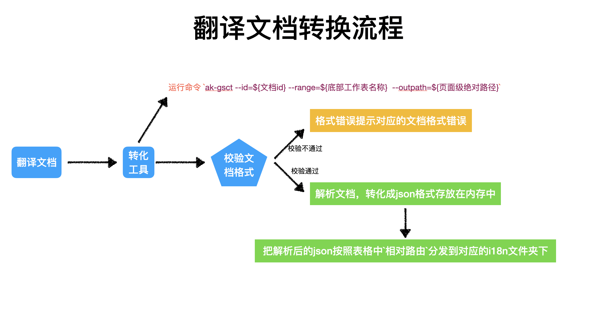
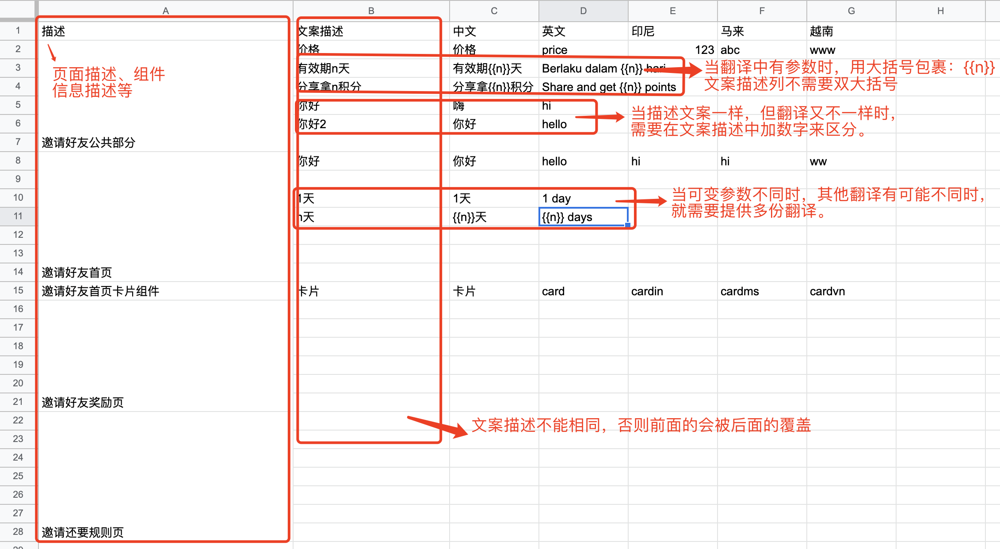

# 翻译文档转换工具

作用：将 google sheets 翻译文档转换到工程目录

流程：

- 定义 google sheets 翻译文档规范
- nodejs 工具 读取正确 sheets 格式 并导出到对应 i18n 文件夹内

流程图：

## google sheets 文档规范

文档格式翻译格式需要按照 `公共-页面-组件` 来进行编写翻译。

格式如下：

- `描述` 栏由产品编写、开发可以进行调整
- `文案描述`: 值唯一，否则前面的会被后面的覆盖
- `...` 后续为各类翻译

主要规则：

1. 第一列为`描述栏`，第二列为`文案描述栏`，后续的列为各类翻译，顺序固定，翻译工具根据列序号进行处理
   - 中文
   - 英文
   - 印尼
   - 马来
   - 越南
   - ...后续新增其他语言
2. 当翻译中需要参数时，用双大括号包裹： `{{n}}` ，文案描述不需要双大括号包裹
3. 当描述文案一样，但翻译文案不一样时，需要在文案描述做出区别：比如后面添加数字区分，如上述图中。
4. 当翻译中需要参数时，且可变参数不同，其他翻译也有不同之处，需要提供多份翻译，比如把不同的单独列出来。

## nodejs 工具

nodejs 工具使用、处理步骤：

- 全局安转工具
- 运行命令： `ak-tc --id=${文档id} --range=${底部工作表名称} --outpath=${页面级绝对路径}`
- 校验文档格式正确性
  - 错误时，打印错误提示
  - 正确时进行下一步
- 解析文档，转化成 json 格式存放在内存中
- 把解析后的 json 按照表格中`相对路由`分发到对应的 i18n 文件夹下

核心实现：

## 扩展

- 自动更新到 git，并自动部署
