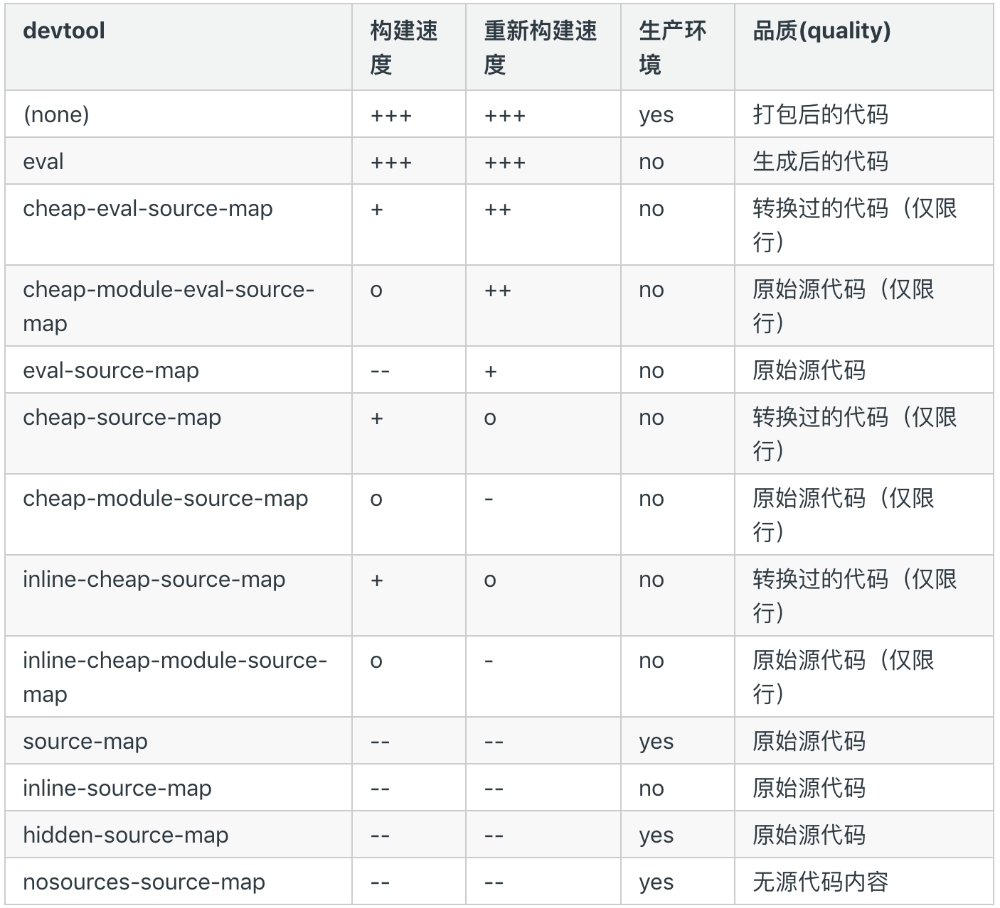
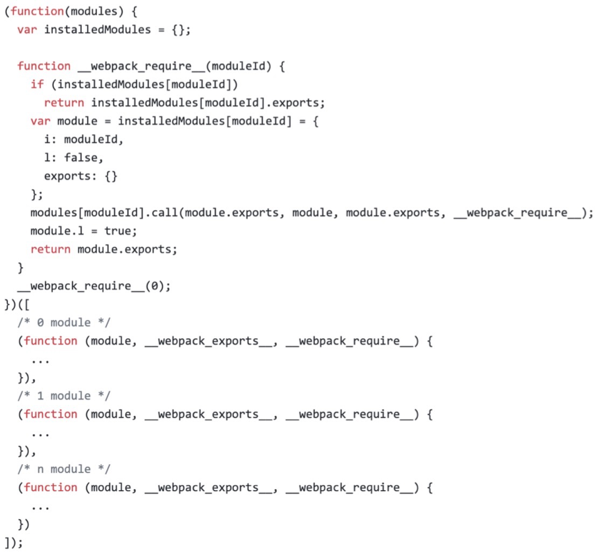
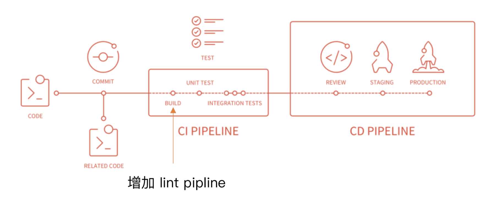

# webpack 进阶

## 代码压缩

### JavaScript 代码压缩

`webpack4` 内置了 `uglifyjs-webpack-plugin`

### CSS 代码压缩

使用 `optimize-css-assets-webpack-plugin` ，需要配合 `cssnano`

```javascript
const OptimizeCSSAssetsPlugin = require('optimize-css-assets-webpack-plugin')
module.exports = {
  plugins: [
    new OptimizeCSSAssetsPlugin({
      assetNameRegExp: /\.css$/,
      cssProcessor: require('cssnano')
    })
  ]
}
```

### HTML 代码压缩

使用 `html-webpack-plugin` , 设置压缩参数

```javascript
const HtmlWebpackPlugin = require('html-webpack-plugin')
module.exports = {
  plugins: [
    new HtmlWebpackPlugin({
      title: '首页',
      template: path.join(__dirname, 'src/index.html'),
      filename: 'index.html',
      chunks: ['index'],
      inject: true,
      // 压缩参数设置
      minify: {
        html5: true,
        collapseWhitespace: true,
        preserveLineBreaks: false,
        minifyCSS: true,
        minifyJS: true,
        removeComments: false
      }
    })
  ]
}
```

## 清理构建目录

### 手动清理

rm -rf ./dist
rimraf ./dist

### 自动清理

避免构建前每次都需要⼿手动删除 `dist` 使⽤ `clean-webpack-plugin`

```javascript
const CleanWebpackPlugin = require('clean-webpack-plugin')
module.exports = {
  // ...
  plugins: [
    // ...
    new CleanWebpackPlugin()
  ]
}
```

## 自动补全 CSS3 前缀

用 postcss-loader 配合 autoprefixer 插件 自动补⻬齐 CSS3 前缀

```javascript
module.exports = {
  module: {
    rules: [
      // ...
      {
        test: /.less$/,
        use: [
          'style-loader',
          'css-loader',
          'less-loader',
          {
            loader: 'postcss-loader',
            options: {
              plugins: () => [
                require('autoprefixer')({
                  overrideBrowserslist: ['last 2 versions', '>1%']
                })
              ]
            }
          }
        ]
      }
    ]
  }
}
```

## 移动端 CSS px 自动转换成 rem

### 方式一 px2rem-loader + lib-flexible

使⽤ `px2rem-loader` 让 px 自动转换成 rem

⽤手淘的 `lib-flexible` 库⻚面渲染时计算根元素的 `font-size` 值

```javascript
module.exports = {
  module: {
    rules: [
      {
        loader: 'px2rem-loader',
        options: {
          remUnit: 37.5,
          remPrecision: 8
        }
      }
    ]
  }
}
```

## 资源内联

代码层面：

- 页面框架的初始化脚本
- 上报相关打点
- css 内联避免页面闪动

请求层面：减少 HTTP 网络请求数

- 小图片或者字体内联： `url-loader`

### HTML 和 JS 内联

使用 raw-loader 内联 html

```html
${ require('raw-loader!./meta.html')} ${require('raw-loader!./meta.html')}
```

使用 raw-loader 内联 js

```html
<script>
  ${ require('raw-loader!babel-loader!../node_modules/lib-flexible/flexible.js')}
</script>
```

### CSS 内联

#### 方案一：借助 style-loader

```javascript
module.exports = {
  module: {
    rules: [
      {
        test: /\.css$/,
        use: [
          {
            loader: 'style-loader',
            options: {
              insertAt: 'top', // 样式插入到 <head>
              singleton: true // 将所有的style标签合并成一个
            }
          },
          'css-loader',
          'less-loader'
        ]
      }
    ]
  }
}
```

#### 方案二：html-inline-css-webpack-loader

## 多页面打包通用方案

动态获取 entry 和对应的 HtmlWebpackPlugin

利用 glob.sync 获取

```javascript
const setMPA = () => {
  const entry = {}
  const htmlWebpackPlugins = []

  const entryFiles = glob.sync(path.join(__dirname, './src/*/index.js'))
  Object.keys(entryFiles).map(index => {
    const entryFile = entryFiles[index]
    const match = entryFile.match(/src\/(.*)\/index\.js$/)
    const pageName = match[1]
    entry[pageName] = entryFile
    htmlWebpackPlugins.push(
      new HtmlWebpackPlugin({
        title: pageName,
        template: path.join(__dirname, `src/${pageName}/index.html`),
        filename: `${pageName}.html`,
        chunks: [pageName],
        inject: true,
        // 压缩参数配置
        minify: {
          html5: true,
          collapseWhitespace: true,
          preserveLineBreaks: false,
          minifyCSS: true,
          minifyJS: true,
          removeComments: false
        }
      })
    )
  })

  return {
    entry,
    htmlWebpackPlugins
  }
}

const { entry, htmlWebpackPlugins } = setMPA()

module.exports = {
  entry,
  plugins: [
    // ...
    ...htmlWebpackPlugins
  ]
}
```

## 使用 source map

作用： 通过 source map 定位到源代码

source map 科普文：
[JavaScript Source Map 详解](http://www.ruanyifeng.com/blog/2013/01/javascript_source_map.html)

### source map 关键字

- `eval`: 使用 eval 包裹模块代码
- `source` map: 产生 `.map` 文件
- `cheap`: 不包含列信息
- `inline`: 将 `.map` 作为 `DateURL` 嵌入，不单独生成 `.map` 文件
- `module`: 包含 `loader` 的 `map` 信息

### source map 类型



官方文档: [devtool](https://www.webpackjs.com/configuration/devtool/)

## 提取页面公共资源

### 基础库分离

思路：将 `react` 、 `react-dom` 基础包通过 cdn 引入，不打入 `bundle` 中
方法：使用 `html-webpack-externals-plugin`

在 index.html 中：

```javascript
<script src="https://cdn.bootcss.com/react/16.9.0-rc.0/umd/react.production.min.js"></script>
<script src="https://cdn.bootcss.com/react-dom/16.9.0-alpha.0/umd/react-dom.production.min.js"></script>
```

在 `webpack.prod.config.js` 中

```javascript
module.exports = {
  // ...
  plugins: [
    // ...
    new HtmlWebpackExternalsPlugin({
      externals: [
        {
          module: 'react',
          entry:
            'https://cdn.bootcss.com/react/16.9.0-rc.0/umd/react.production.min.js',
          global: 'React'
        },
        {
          module: 'react-dom',
          entry:
            'https://cdn.bootcss.com/react-dom/16.9.0-alpha.0/umd/react-dom.production.min.js',
          global: 'ReactDOM'
        }
      ]
    })
  ]
}
```

### 利用 SplitChunksPlugin 进行公共脚本分离

`SplitChunksPlugin`插件时 `webpack4` 内置的，替代 `CommonsChunkPlugin` 插件

`chunks` 参数说明：

- async 异步引入的库进行分离(默认)
- initial 同步引入的库进行分离
- all 所有引入的库进行分离(推荐)

下面进行配置：

```javascript
// common/index.js
export function common() {
  return 'common module'
}

// webpack.prod.config.js
module.exports = {
  // ...
  optimization: {
    splitChunks: {
      minSize: 10, //单位b 包的体积大小超过设定值时才会进行分离
      cacheGroups: {
        // 分离基础包（第三方库）
        thrids: {
          test: /(react|react-dom)/, // 匹配出需要分离的包
          name: 'venders',
          chunks: 'all'
        },
        // 分离页面公共文件
        commons: {
          name: 'commons',
          chunks: 'all',
          minChunks: 2 // 设定最小引用的次数，大于该值时才会进行分离
        }
      }
    }
  }
}
```

把 chunk name 加入到 html 中

```javascript
moudle.exports = {
  plugins: [
    // ...
    new HtmlWebpackPlugin({
      template: path.join(__dirname, `src/index.html`),
      filename: `index.html`,
      // 加入'venders', 'commons'
      chunks: ['venders', 'commons', 'index'],
      inject: true,
      // 压缩参数配置
      minify: {
        html5: true,
        collapseWhitespace: true,
        preserveLineBreaks: false,
        minifyCSS: true,
        minifyJS: true,
        removeComments: false
      }
    })
  ]
}
```

## `Tree Shaking`(摇树优化) 的使用和原理分析

概念：1 个模块可能有多个方法，只要其中的某个方法使⽤到了，则整个文件都会被打到 bundle 里⾯去，tree shaking 就是只把用到的⽅法打入 bundle ，没用到的⽅法会在 uglify 阶段被擦除掉。

使用：webpack 默认支持，production mode 的情况下默认开启

要求：必须是 es6 的语法，cjs(CommonJS) 方式不支持

```javascript
// 开启摇树优化 production 模式默认开启
module.exports = {
  optimization: {
    true
  }
}
```

development 模式开启也不会直接去掉，只会注释标注，在 uglify 阶段才会被擦除掉

sideEffects 配合 `Tree Shaking`

```json
// package.json
{
  // "sideEffects": false // 默认对所有引入文件进行摇树优化
  "sideEffects": [
    "*.css" // 对css不进行摇树优化
  ]
}
```

### DCE(Dead code elimination) 删除无用的代码

无用代码的定义：

- 代码不会被执行，不可到达
- 代码的执行结果不会被用到
- 代码只会影响死变量（只读不写）

比如：

```javascript
if(false) {
	console.log('这段代码永远不会执行’)
}
```

### Tree shaking 原理

利用 ES6 模块的特点：

- 只能作为模块顶层的语句出现， 不能出现在 function 里面或是 if 里面等块级作用域中
- `import` 的模块名只能是字符串常亮
- `import binding` 是 `immutable` 的，类似 `const`

代码擦除： `uglify` 阶段删除无用的代码

## scope hoisting

webpack 本身构建后的代码存在⼤量闭包代码（mode 为 none 时可以观察到）
编译前：

```javascript
import { helloworld } from './helloworld'

document.write(helloworld())
```

编译后：


这样会导致以下问题：

- 大量作用域包裹代码，导致体积变大，模块越多越明显
- 运行代码时创建的函数作用域变多，内存开销变大

### 模块转换分析

- 被 webpack 转换后的模块会带上一层包裹
- import 会被转换成 \_webpack_require

### 进一步分析 webpack 的模块机制



分析：

- 打包出来的是一个 `IIFE（匿名闭包）`
- `modules` 是一个数组，每一项是一个模块初始化函数
- `__webpack_require` 用来加载模块，返回 `module.exports`
- 通过 `__webpack_require__(__webpack_require__.s = 0)` 启动程序

### scope hoisting 原理

原理： 将所有模块的代码按照引用顺序放在一个函数作用域里，然后适当的重命名一些变量以防变量名冲突
对比： 通过 `scope hoisting` 可以减少函数声明代码和内存开销

使用 `scope hoisting` 前：


使用 `scope hoisting` 后：


### scope hoisting 使用

`webpack` `mode` 为 `production` 默认开启
注意：必须是 `ES6` 语法，`CJS` 不不⽀支持

手动开启使用 webpack 内置插件 `webpack.optimize.ModuleConcatenationPlugin`

```javascript
module.exports = {
  plugins: [new webpack.optimize.ModuleConcatenationPlugin()]
}
```

## 代码分割的意义

对于大型的 Web 应用来讲，将所有的代码都放在一个文件中显然是不够有效的，特别是当你的 某些代码块是在某些特殊的时候才会被使用到。webpack 有一个功能就是将你的代码库分割成 chunks(语块)，当代码运行到需要它们的时候再进行加载。

代码分割的使用：

- 抽离相同代码到一个共享块
- 脚本懒加载，使得初始化时下载的代码更小
- 公用模块内容不变的情况下，分割后的文件的 chunk hash 值也不会变，浏览器就会利用缓存

### 懒加载 JS 脚本的方式

CommonJS: require.ensure

ES6: 动态 import（目前还没有原生支持，需要 babel 转换）

### 动态 import

安装 babel 插件

```bash
npm install @babel/plugin-syntax-dynamic-import --save-dev
```

配置：

```javascript
"plugins": ["@babel/plugin-syntax-dynamic-import"],
```

使用：

```javascript
// src/index/lazyComp.js
import React from 'react'
export default () => <div>动态 import</div>

// src/index/index.js
import('./lazyComp.js').then(lazyComp => {
  this.setState({ LazyComp: lazyComp.default })
})
```

[点击查看官方文档代码分离说明](https://webpack.docschina.org/guides/code-splitting/)

## ESLint

### ESLint 的必要性

- 统一团队风格
- 检测代码错误

### 行业里的优秀 ESLint 规范实践

- [Airbnb 的 eslint-config-airbnb、 eslint-config-airbnb-base](https://github.com/airbnb/javascript)
- [alloyteam 团队 eslint-config-alloy](https://github.com/AlloyTeam/eslint-config-alloy)
- [ivweb 团队:eslint-config-ivweb](https://github.com/feflow/eslint-config-ivweb)

### 制定团队的 ESLint 规范

- 不不重复造轮⼦子，基于 eslint:recommend 配置并改进
- 能够帮助发现代码错误的规则，全部开启
- 帮助保持团队的代码⻛格统一，⽽不是限制开发体验

### ESLint 如何落地

1. 和 CI/CD 系统集成

2. 和 webpack 集成

#### 方案一 webpack 与 CI/CD 集成

1. 在 build 阶段增加 lint pipline



2. 本地开发阶段增加 precommit 钩子

安装 husky

```bash
npm i -D husky
```

增加 `npm script`，通过 `lint-staged` 增量检查修改的文件

```json
{
  "scripts": {
    "precommit": "lint-staged"
  },
  "lint-staged": {
    "linters": {
      "*.{js,scss}": ["eslint --fix", "git add"]
    }
  }
}
```

#### 方案二： webpack 与 ESLint 集成

使⽤ eslint-loader，构建时检查 JS 规范

```javascript
module.exports = {
  module: {
    rules: [
      {
        test: /.jsx?$/,
        use: ['babel-loader', 'eslint-loader']
      }
    ]
  }
}
```

## webpack 打包库和组件
