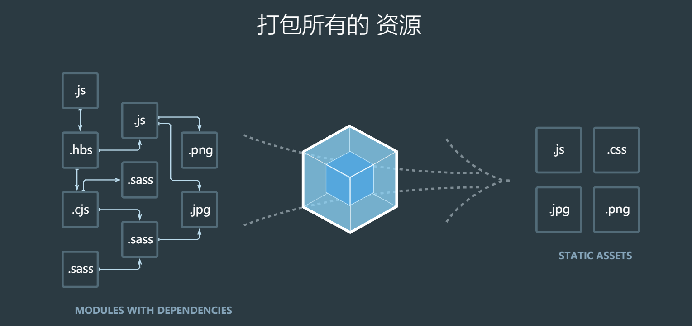

# webpack 基础

## 核心概念之 entry

`entry` 是用来指定 webpack 的打包入口

### 理解 webpack 依赖图



依赖图的入口是 `entry`，对于非代码比如图片，字体依赖也会不断加入到依赖图中

### Entry 的用法

1. 单入口：`entry`是一个字符串

```javascript
module.exports = {
  entry: './src/index.js'
}
```

2. 多入口

```javascript
module.exports = {
  entry: {
    main: './src/index.js',
    app: './src/app.js'
  }
}
```

## 核心概念之 output

`output` 用来告诉 `webpack` 如何将编译后的文件输出到磁盘

### output 的用法

1. 单入口配置

```javascript
module.exports = {
  entry: './src/index.js',
  output: {
    filename: 'bundle.js',
    path: __dirname + 'dist'
  }
  // 或者
  // output: __dirname + 'dist/bundle.js'
}
```

2. 多入口配置

```javascript
module.exports = {
  entry: {
    main: './src/index.js',
    app: './src/app.js'
  },
  output: {
    filename: '[name].js',
    path: __dirname + '/dist'
  }
  // 或者
  // output: __dirname + 'dist/bundle.js'
}
```

## 核心概念之 Loaders

`webpack` 开箱即用只支持 `JS` 和 `JSON` 两种文件类型，通过 Loaders 去支持其它文件类型并且把它们转换成有效的模块，并添加到依赖图中。

`loader` 本身是一个函数，接受源文件作为参数，返回转换后的结果。

### 常见的 loaders

| loader 名称     | 描述                       |
| --------------- | -------------------------- |
| `babel-loader`  | 转换 ES6、ES7 等新特性语法 |
| `css-loader`    | 支持.css 文件的加载和解析  |
| `less-loader`   | 将 less 转换成 css         |
| `ts-loader`     | 将 ts 转换成 js            |
| `file-loader`   | 进行图片、字体的打包       |
| `raw-loader`    | 将文件以字符串的形式导入   |
| `thread-loader` | 多进程打包 js 和 css       |

中文官网 `loaders` 列表： [https://www.webpackjs.com/loaders/](https://www.webpackjs.com/loaders/)

### loaders 的用法

```javascript
const path = require('path')
module.exports = {
  module: {
    rules: [{ test: /\.txt/, use: 'raw-loader' }]
  }
}
```

- test 指定匹配规则
- use 指定使用的 loader 名称

## 核心概念之 Plugins

插件用于 bundle 文件的优化、资源管理和环境变量注入

作用于整个构建过程

### 常见的 Plugins

| plugin 名称                | 描述                                             |
| -------------------------- | ------------------------------------------------ |
| `CommonsChunkPlugin`       | 将 chunks 相同的模块提取公共 js                  |
| `CleanWebpackPlugin`       | 清理构建目录                                     |
| `ExtractTextWebpackPlugin` | 将 css 从 bundle 文件里提取成一个独立的 css 文件 |
| `CopyWebpackPlugin`        | 将文件或者文件夹拷贝到输出目录                   |
| `HtmlWebpackPlugin`        | 创建 html 文件去承载输出的 bundle                |
| `UglifyjsWebpackPlugin`    | 压缩 js                                          |
| `ZipWebpackPlugin`         | 将打包的资源生成一个 zip 包                      |

中文官网 `plugins` 列表： [https://www.webpackjs.com/plugins/](https://www.webpackjs.com/plugins/)

### Plugins 的用法

```javascript
const HtmlWebpackPlugin = require('html-webpack-plugin')

module.exports = {
  plugins: [
    new HtmlWebpackPlugin({
      template: './public/index.html'
    })
  ]
}
```

## 核心概念之 Mode

`Mode` 是用来指定当前的构建环境是 `production` 、 `development` 还是 `none`

设置 `mode` 可以使用 `webpack` 内置的函数，默认值为 `production`

### Mode 的内置函数功能

| 选项          | 描述                                                                                                                                                                                                                                        |
| ------------- | ------------------------------------------------------------------------------------------------------------------------------------------------------------------------------------------------------------------------------------------- |
| `development` | 会将 `process.env.NODE_ENV` 的值设为 `development`。启用 `NamedChunksPlugin` 和 `NamedModulesPlugin`。                                                                                                                                      |
| `production`  | 会将 `process.env.NODE_ENV` 的值设为 `production`。启用 `FlagDependencyUsagePlugin`, `FlagIncludedChunksPlugin`, `ModuleConcatenationPlugin`, `NoEmitOnErrorsPlugin`, `OccurrenceOrderPlugin`, `SideEffectsFlagPlugin` 和 `UglifyJsPlugin`. |
| `none`        | 不开启任何优化选项                                                                                                                                                                                                                          |

## 资源解析：解析 ES6

使用 babel-loader，babel 的配置文件是.babelrc

```javascript
// webpack.config.js
module.exports = {
  module: {
    rules: [
      // ...
      {
        test: /\.js$/,
        use: 'babel-loader'
      }
    ]
  }
}
// .babelrc
{
  "presets": ["@babel/preset-env"]
}
```

## 资源解析：解析 React JSX

```javascript
// .babelrc
{
  "presets": ["@babel/preset-env","@babel/preset-react"]
}
```

## 资源解析：解析 CSS

- `css-loader` 用于加载 `.css` 文件，并且转换成 `commonjs` 对象
- `style-loader` 将样式通过 `<style>` 标签插入到 `head` 中

```javascript
module.exports = {
  // ...
  module: {
    rules: [
      // ...
      {
        test: /\.css$/,
        use: ['style-loader', 'css-loader']
      }
    ]
  }
}
```

## 资源解析：解析 Less 和 Sass

- `less-loader`: 用于将 `less` 转换成 `css`
- `less`: `less-loader` 需要依赖`less`
- `sass-loader`: 用于将 `scss` 转换成 `css`
- `node-sass`: `sass-loader` 需要依赖`node-sass`

```javascript
module.exports = {
  // ...
  module: {
    rules: [
      // ...
      {
        test: /\.less$/,
        use: ['style-loader', 'css-loader', 'less-loader']
      },
      {
        test: /\.scss$/,
        use: ['style-loader', 'css-loader', 'sass-loader']
      }
    ]
  }
}
```

## 资源解析：解析图片和字体

- `file-loader` 用于处理文件
- `url-loader` 也可以处理理图⽚片和字体 可以设置较小资源自动转为 `base64`

```javascript
// file-loader 使用
{
  test: /\.(png|svg|jpg|gif)$/,
  use: 'file-loader'
}

// url-loader 使用
{
  test: /\.(png|svg|jpg|gif)$/,
  use: [
    {
      loader: 'url-loader',
      options: {
        limit: 10240
      }
    }
  ]
}
```

## webpack 中的⽂文件监听

文件监听是在发现源码发生变化时，自动重新构建处新的输出文件

`webpack` 开启监听模式的两种方式：

- 启动 `webpack` 命令时，带上 `--watch` 参数
- 在配置 `webpack.config.js` 中设置 `watch:true`

```bash
  "scripts": {
    "build": "webpack --watch"
  }
```

```javascript
  watch: true, // 默认false
  watchOptions: {
    // 忽略node_modules的变化
    ignored: /node_modules/,
    // 监听到文件变化后，等300ms再去执行，默认300ms
    aggregateTimeout: 300,
    // 判断文件是否发生变化时通过不停的询问系统指定文件有没有变化，默认每秒询问1次
    poll: 1000 // 单位ms
  }
```

## 热更新： webpack-dev-server

WDS 不需要手动刷新浏览器
WDS 不输出文件，而是放在内容中
使用 HotModuleReplacementPlugin 插件可以页面无刷新重新渲染

## 文件指纹

### 文件指纹是啥？

文件指纹是指打包后输出的⽂文件名的后缀

### 文件指纹如何生成？

`hash` 和整个项目的构建相关，只要项目文件有修改，整个项目构建的 hash 值就会更改 所有的文件哈希值一样。
`chunkhash` 和 webpack 打包的 chunk 有关，不不同的 entry 会⽣生成不不同的 chunkhash 值。
`contenthash` 根据⽂文件内容来定义 hash ，⽂文件内容不变，则 contenthash 不变。 比如 1. css 文件中，当引入的 css 文件的主文件变化，css 未变化打包后的 hash 后缀就不会改变，2. 如果 css 不使用 contenthash，那么打包后 css 的哈希后缀 会和 js 哈希后缀一样，也会变，3. 如果这时候 js 仍然使用 chunkhash，每次 css 更改，js 的哈希后缀 也会变化

### 当你的网站需要考虑长效缓存，可以使用不同的 hash

1. 当没有将 css 从 chunk 中抽离时直接使用 chunkhash
2. 当使用 mini-css-extract-plugin 插件抽离 css 时,可将 chunk 和 css 块都使用 contenthash 替换达到互不影响的作用
3. 不要使用 hash，这可能因为 webpack 的修改导致 hash 值变动而使缓存失效

关于 hash 的使用场景，可考虑将其作为版本控制；

参考
[Webpack 疑问系列之 hash/chunkhash/contenthash 区别](https://juejin.im/post/5cd5586a5188254459335921)

### JS 的文件指纹设置

```javascript
module.exports = {
  entry: {
    main: './src/index.js',
    app: './src/app.js'
  },
  output: {
    filename: '[name]_[chunkhash:8].js',
    path: __dirname + '/dist'
  }
}
```

### CSS 的文件指纹设置

```javascript
const MiniCssExtractPlugin = require('mini-css-extract-plugin')
module.exports = {
  entry: {
    main: './src/index.js',
    app: './src/app.js'
  },
  output: {
    // 这里设置contenthash是为了避免css文件变化后，
    // 引用该css的js文件hash后缀跟着变
    filename: '[name]_[contenthash:8].js',
    path: __dirname + '/dist'
  },
  module: {
    rules: [
      {
        test: /\.less$/,
        use: [
          MiniCssExtractPlugin.loader,
          'css-loader',
          'less-loader',
          'postcss-loader'
        ]
      }
    ]
  },
  plugins: [
    new MiniCssExtractPlugin({
      filename: '[name]_[contenthash:8].css'
    })
  ]
}
```

### 图片的文件指纹

设置 file-loader 或者 url-loader 的 filename，使用 [hash]
这里的 hash 值根据图片的内容生成，图片没变化 hash 值是不会变化的

```javascript
{
  test: /\.(png|svg|jpe?g|gif)$/,
  use: [
    {
      loader: 'url-loader',
      options: {
        name: '[name]_[hash:8].[ext]',
        limit: 10240
      }
    }
  ]
}
```

### 注意点

如果使用了 HotModuleReplacementPlugin 插件，输出的 chunk 文件指纹只能是 hash

## JS文件压缩


