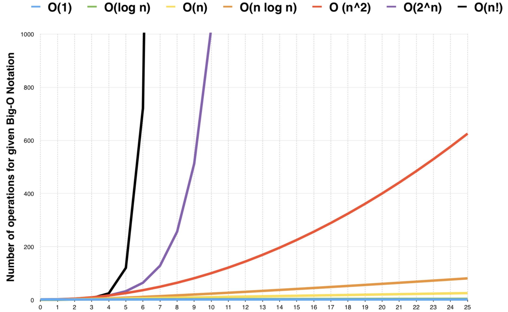

# 复杂度分析 (时间复杂度和空间复杂度)

## 什么是复杂度分析？

- `数据结构和算法`是为了解决“如何让计算机更快时间、更省空间”这个问题。
- 因此可以从`执行时间`和`占用空间`两个维度来评估代码执行的性能。
- 分别用 `时间复杂度` 和 `空间复杂度` 两个概念来描述性能问题。
- 复杂度主要用于描述算法`执行时间(或占用空间)`与`数据规模`的增长关系。

### 为什么要进行复杂度分析?

- 和性能测试相比，复杂度分析有不依赖执行环境、成本低、效率高、易操作、指导性强的特点。
- 掌握复杂度分析，将能编写出性能更优的代码，有利于降低系统开发和维护成本。

### 如何进行复杂度分析?

- 大 O 表示法
  - 来源: 算法的执行时间与每行代码的执行次数成正比，用 T(n) = O(f(n))表示，其中 T(n)表示算法执行总时间，f(n)表示每行代码执行总次数，而 n 往往表示数据的规 模。
  - 特点: 以时间复杂度为例，由于时间复杂度描述的是算法执行时间与数据规模的增长变化趋势，所以常量阶、低阶以及系数实际上对这种增长趋势不产决定性影响 ，所以在做时间复杂度分析时忽略这些项。
- 复杂度分析法则
  - 单段代码看高频: 比如循环。
  - 多段代码取最大: 比如一段代码中有单循环和多重循环，那么取多重循环的复杂度.
  - 嵌套代码求乘积: 比如递归、多重循环等
  - 多个规模求加法: 比如方法有两个参数控制两个循环的次数，那么这时就取二者复杂度相加。
- 常用的复杂度级别？
  - 多项式阶: 随着数据规模的增长，算法的执行时间和空间占用，按照多项式的比例增长。包括: O(1)（常数阶）、O(logn)（对数阶）、O(n)（线性阶）、O(nlogn)（线性对数阶）、O(n^2)（平方阶）、O(n^3)（立方阶）
  - 非多项式阶: 随着数据规模的增长，算法的执行时间和空间占用暴增，这类算法性能极差。包括: O(2^n)（指数阶）、O(n!)（阶乘阶）
- 如何掌握好复杂度分析方法？
  - 复杂度分析关键在于多练，所谓孰能生巧。

下面是几个常用的复杂度：

1. `O(1)`

O(1)只是常量级时间复杂度的一种表示方法，并不是指只执行了一行代码。必如下面这段代码，即使有 3 行，它的时间复杂度也是 O(1)

```js
const i = 2
const j = 3
const sum = i + j
```

只要代码的执行时间不随 n 的增大而增长，这样代码的时间复杂度我们都记作 O(1)。或者说，一般情况下，只要算法中不存在循环语句、递归语 句，即使有成千上万行的代码，其时间复杂度也是 Ο(1)。

2. `O(n)` 线性复杂度

```js
let i = 1
while (i <= n) {
  i++
}
```

3. `O(logn)` 和 `O(nlogn)` 对数复杂度

对数阶时间复杂度非常常见，但也是最难分析的一种时间复杂度，举个 🌰:

```js
let i = 1
while (i <= n) {
  i = i * 2
}
```

4. `O(n^2)` 平方

```js
for (let i = 0; i < n; i++) {
  for (let j = 0; j < n; j++) {
    console.log(i, n)
  }
}
```

5. `O(2^n)` 指数

```js
for (let i = 0; i < Math.pow(2, n); i++) {
  console.log(i)
}
```

6. `O(!n)` 阶乘

```js
function factorial(n) {
  let res = 1
  for (let i = 2; i <= n; i++) {
    res = res * i
  }
  return res
}

for (let i = 0; i < factorial(n); i++) {
  console.log(i)
}
```

复杂度曲线分析图：



## 最好、最坏、平均、均摊时间复杂度

同一段代码在不同情况下时间复杂度会出现量级差异，为了更全面，更准确的描述代码的时间复杂度，所以引入最好、最坏、平均、均摊四个时间复杂度，部分情况下不需要去分析它们。

### 概念介绍

先举个例子

```js
function find(array, x) {
  let pos = -1
  for (let i = 0; i < array.length; i++) {
    if (array[i] === x) {
      pos = i
    }
  }
  return pos
}
```

从以上代码可以看出，在一个无序的数组(array)中，查找变量 x 出现的位置，如果没有找到，就返回`-1`。
这段代码的复杂度是`O(n)`，其中，`n`代表数组的长度。

我们在数组中查找一个数据，并不需要每次都把整个数组都遍历一遍，因为有可能中途找到就可以提前结束循环了。

优化后的代码：

```js
function find(array, x) {
  for (let i = 0; i < array.length; i++) {
    if (array[i] === x) {
      return i
    }
  }
  return -1
}
```

这段代码的时间复杂度还是 O(n)吗?

如果数组中第一个元素正好是要查找的变量 x，那就不需要继续遍历剩下的 n-1 个数据了，那时间复杂度就
是 `O(1)`。但如果数组中不存在变量 x，那我们就需要把整个数组都遍历一遍，时间复杂度就成了 O(n)。所以，不同的情况下，这段代码的时间复杂度是不一样的。所以这里就需要引入三个概念：最好情况时间复杂度、最坏情况时间复杂度和平均情况时间复杂度。

- 最好时间复杂度：在最理想的情况下，执行代码的时间复杂度
- 最坏时间复杂度：在最糟糕的情况下，执行这段代码的时间复杂度。
- 平均时间复杂度：代码在不同情况下复杂度出现量级差别，则用代码所有可能情况下执行次数的加权平均值表示。
- 均摊时间复杂度：在代码执行的所有复杂度情况中绝大部分是低级别的复杂度，个别情况是高级别复杂度且发生具有时序关系时，可以将个别高级别复杂度均摊到低级别复杂度上。基本上均摊结果就等于低级别复杂度。
