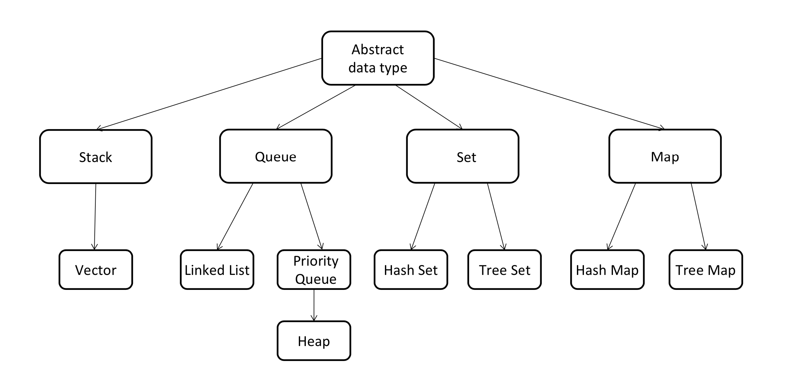

## 如何有效的学习和训练算法和数据结构

- Chunk it up (切碎知识点)
- Deliberate practicing (刻意练习)
- 多问、多思考、多互动
- 知识需要沉淀，不要想试图一下子掌握所有
- Feedback (获得反馈)

### 切碎知识点

- 庖丁解牛 把知识拆分
- 脉络连接

数据结构脉络连接：

### 刻意练习

- 练习缺陷、不舒服、弱点地方
- 不爽、枯燥
- 适度刷题，可以在 LeetCode 上去刷一些对应的题

### 知识需要沉淀，不要想试图一下子掌握所有

在学习的过程中，一定会碰到“拦路虎”。如果哪个知识点没有怎么学懂，不要着急，这是正常的。因为，想听一遍、看一遍就把所有知识掌握，这肯定是不可能的。学习知识的过程是反复迭代、不断沉淀的过程。

### 获得反馈

- 即时反馈
- 主动型反馈（自己去找）
  - 高手代码 (GitHub, LeetCode, etc.)
- 被动式反馈 (高手给你指点)
  - code review

## 切题四件套

- 明确题目意思
- 把所有可能的解决方案列出
  - 比较时间和空间复杂度
  - 找出最优解
- Coding 多写
- 写案例
